# VSDSquadronMini Research Internship - 20th October Cohert
 

The program is based on RISC-V architecture and uses open-source tools to teach people about VLSI and RISC-V
 
Instructor: Kunal Ghosh

 

<h2> TASK 1 </h2>
<h3> Installation of RISC-V toolchain using VDI. Uploading the snapshot of complied Ccode and RISC-V Objdmp on GitHub</h3> 

The task 1 includes completion of the following instructions
 
<ol>
  <li> Creating GitHub repo. </li>
   
  <li> Installation of Oracle VirtualBox. </li>
   
  <li> Installation of RISC-V toolchain using VDI. </li>
   
  <li> Writing C program to find sum of n numbers. </li>
   
  <li> Using RISC-V Simulator for compiling and running the code. </li>
   
  <li> Uploading the snapshots </li>
   
</ol>
<h4>
  STEPS:
   
  <OL>
    <li>
      Installation of Oracle VirtualBox.</li>
      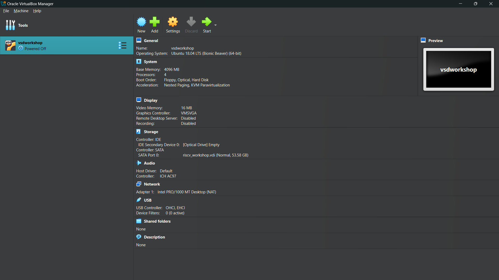 
      <li>Home screen of Ubuntu.</li>
      
     
      <li>Open the terminal.</li>
      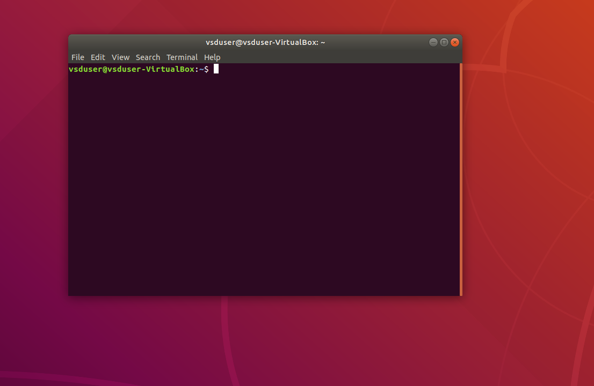  
      <li>Enter the following instructions shown in image below.Write the c code as shown and save the file.</li>
      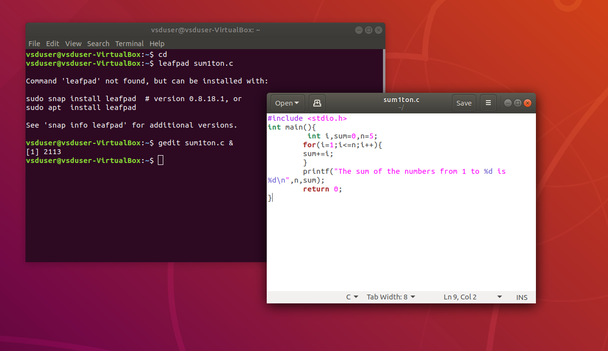  
      <li>Execute the code.</li>
      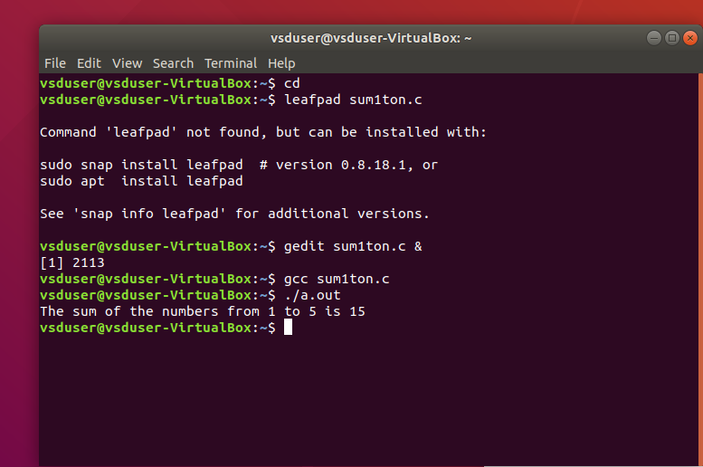  
      <li>Verification using calculator.</li>
      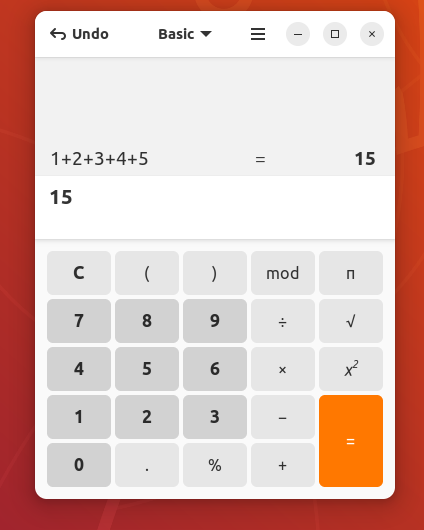  
      <li>Follow the instruction shown in the images below.</li>
      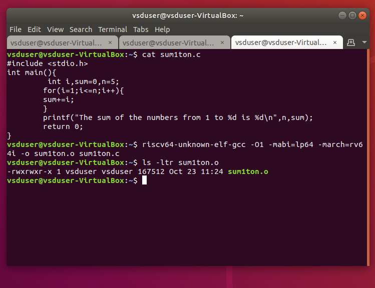
      
        
      <li>Output.</li>
       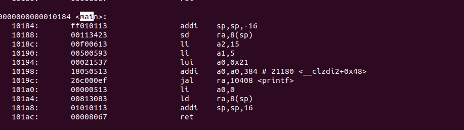
        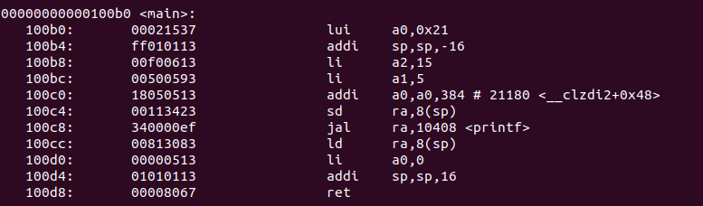
  </OL>
</h4>
  

 
 

 

<h2> TASK 2 </h2>
<h3>Debug the task 1 code using SPIKE. Write a simple c program for any application and compile it with RISC-V GCC/SPIKE </h3> 

Tansk 2 involves completion of the following tasks
 
<ol>
  <li> To use SPIKE and debug sum 1 to n c program </li>
  <li> To verify if the output in both cases are same </li>
  <li> Write a simple C program (Here I've taken the example of XOR gate) </li>
  <li> Follow the same steps done in Task 1</li>
  <li>  Upload the snapshots</li>
</ol>
<h4>
  STEPS:
   
  <OL>
   <li>
      Follow the instructions shown below in the image. We can observe the same output when gcc or SPIKE is used </li>
      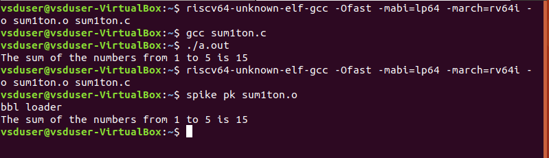 
      <li>Enter the below instructions and debug using SPIKE (-d for debug) </li>
       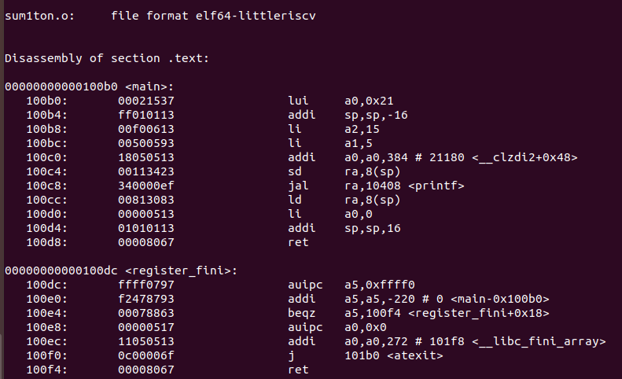 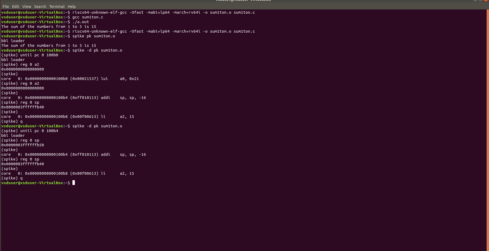
     
      <li>XOR gate is a digital logic gate that outputs 1 only when an odd number of its inputs are true. It is used in data comparision, error detection, binary addition etc.  </li>
      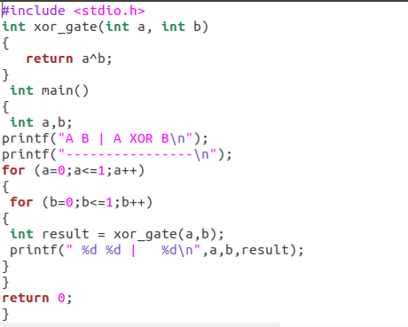  
      <li>Follow the instructions same as in Task 1.</li>
      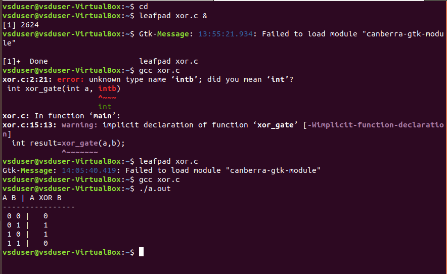  
     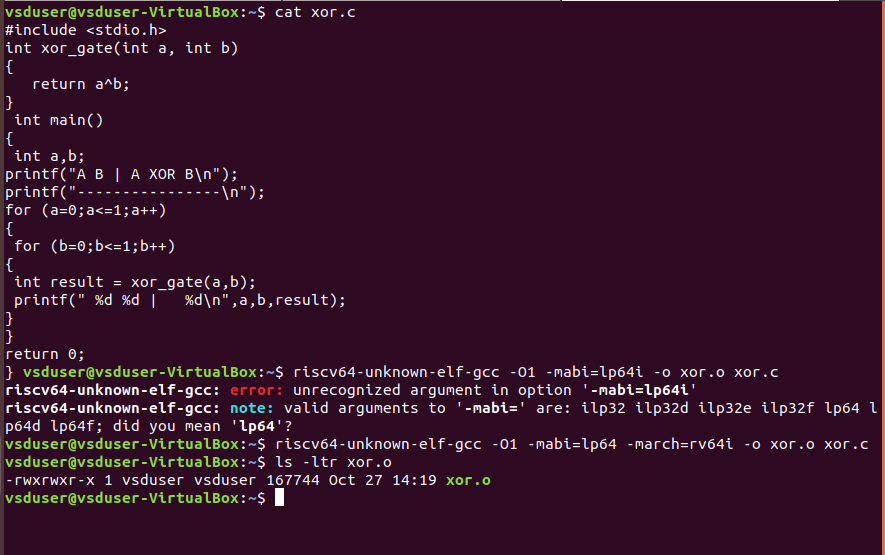  
     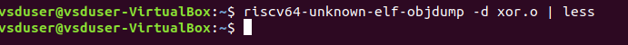  
     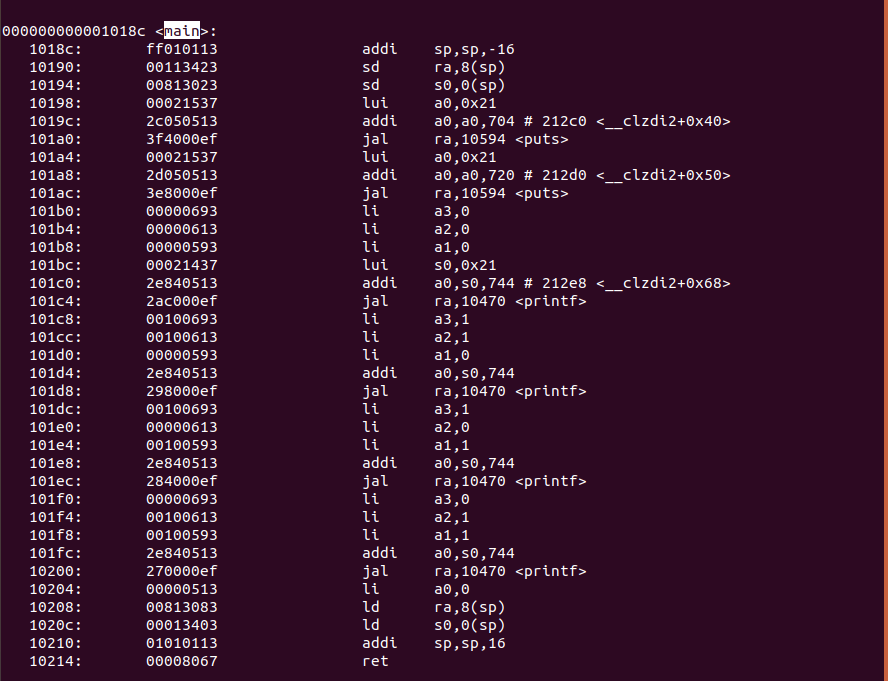  
     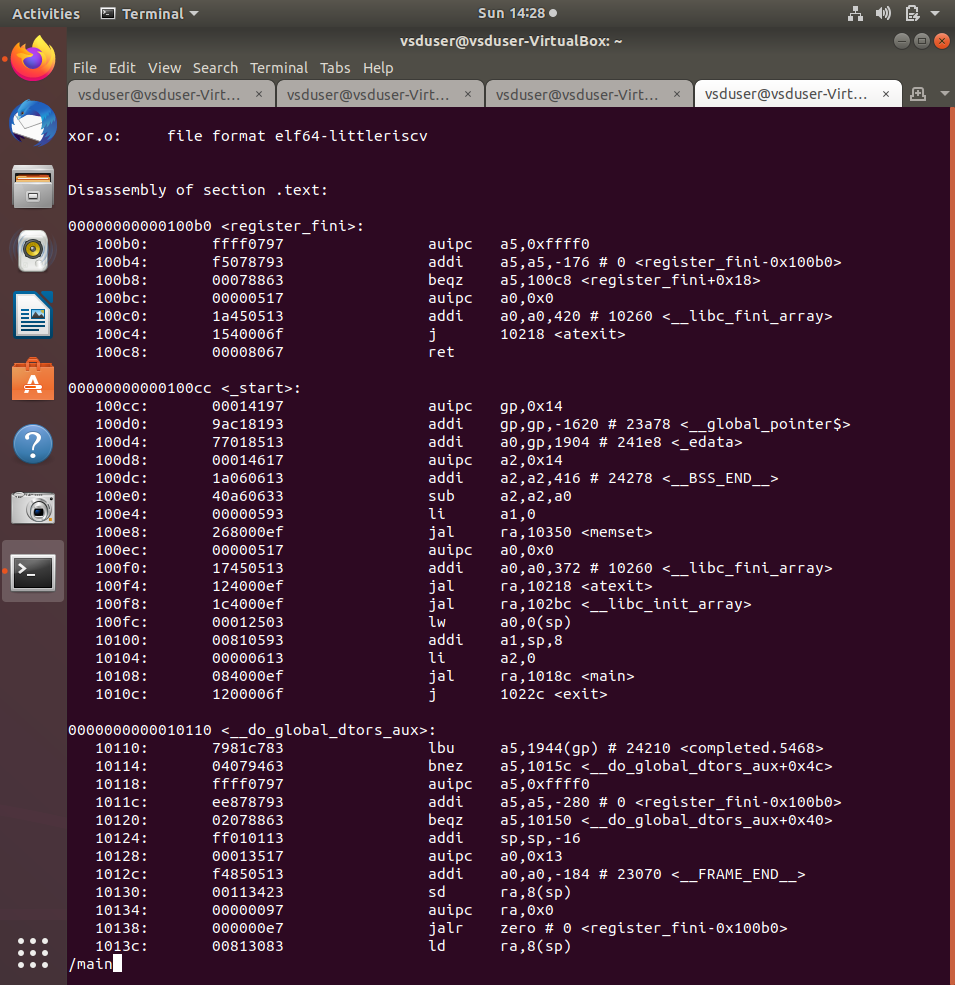  
       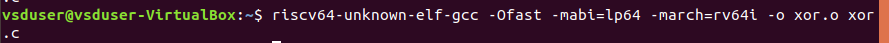  
     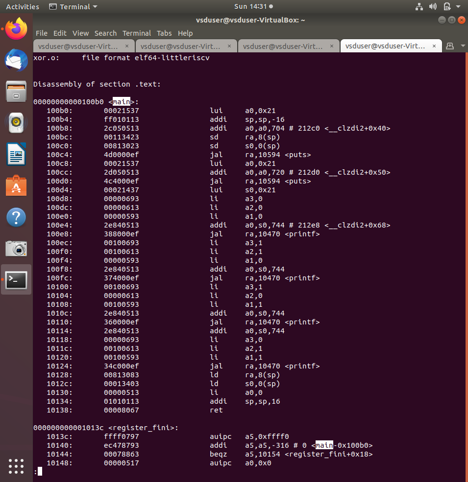  
     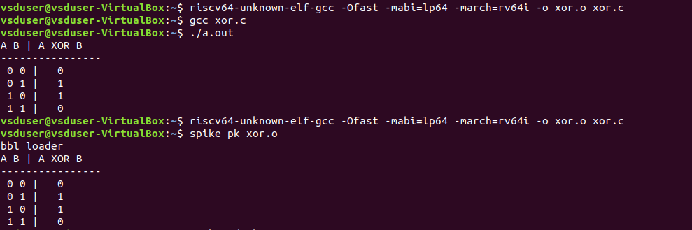  
      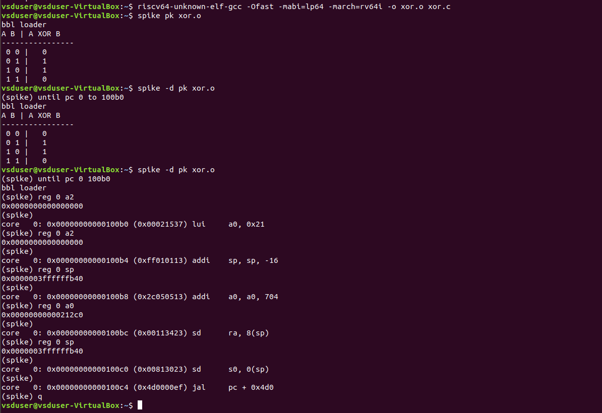  
      
  </OL>
</h4>

 
 

 

 <h2> TASK 3</h2>
<h3>To understand the instruction type and find out instruction type used in previous RISC-V objdump.To find exact 32 bit instruction code. </h3>

Task 3 involves completion of the following tasks
 
<ol>
  <li> List various RISC-V instruction type (R, I, S, B, U, J) after going through RISC-V software documentation </li>
  <li> Identify 15 unique RISC-V instructions from riscv-objdmp of your application code  </li>
  <li> Identify exact 32-bit instruction code in the instruction type format for 15 unique instructions </li>
  <li> Upload the 32-bit pattern on Github </li>
</ol>
RISC-V Instruction Types (R,I,S,B,U,J):
In RISC-V architecture, instructions are classified into different instruction types based on their format and usage. There are six main instruction types: R-type, I-type, S-type, B-type, U-type, and J-type. Each type has a different purpose and layout in the instruction format.

1. R-type (Register)
   
Purpose: Used for operations that involve registers, such as arithmetic or logic operations between two registers.

opcode: Operation code (6 bits)

rd: Destination register (5 bits)

rs1: First source register (5 bits)

rs2: Second source register (5 bits)

funct3: Function code (3 bits)

funct7: Additional function code (7 bits)

2. I-type (Immediate)

Purpose: Used for operations involving an immediate value (constant) and a register.

opcode: Operation code (7 bits)

rd: Destination register (5 bits)

rs1: Source register (5 bits)

imm: Immediate value (12 bits)

3. S-type (Store)
   
Purpose: Used for store operations, where data is stored from a register to memory.

opcode: Operation code (7 bits)

rs1: Base register (5 bits)

rs2: Source register (5 bits)

funct3: Function code (3 bits)

imm: Immediate value (12 bits, split into two parts)

4.B-type (Branch)

Purpose: Used for branch operations, which control program flow based on conditions (e.g., branch if equal, branch if less than).

opcode: Operation code (7 bits)

rs1: First register (5 bits)

rs2: Second register (5 bits)

funct3: Function code (3 bits)

imm: Immediate value (12 bits, split into multiple fields)

5. U-type (Upper Immediate)
   
Purpose: Used for instructions that operate on an immediate value, especially for setting a large immediate value in the upper 20 bits.

opcode: Operation code (7 bits)

rd: Destination register (5 bits)

imm: Immediate value (20 bits)

6. J-type (Jump)
   
Purpose: Used for jump operations, which are typically used to perform unconditional jumps (like a function call or returning from a function).

opcode: Operation code (7 bits)

rd: Destination register (5 bits, typically used for the return address in some instructions)

imm: Immediate value (20 bits, split into multiple fields)

15 Unique Instructions and Their 32-bit Machine Code:
 

 <h2> TASK 4</h2>
<h3> To understand how to use given verilog code and testbench and to upload waveform.</h3> 
**NOTE:** SInce the designing of RISCV Architecture and writing it's testbench is not part of this research Internship, so will use the Verilog COde and Testbench of RISCV that has already been designed. This reference GitHub repository is: [iiitb_rv32i](https://github.com/vinayrayapati/rv32i/)**

Task 4 involves completion of the following tasks
 
<ol>
  <li> To use RISC-V Core Verilog netlist and testbench for functional simulation experiment.</li>
  <li>  To upload waveform snapshots on GitHub. </li>
</ol>
<h4>
  STEPS:
   
  <OL>
    <li>
      Check if GTKWave is installed else install it.</li>
      <li>Create a directory using mkdir.</li>
     <li>Create two files one for writing the code and other for writing testbench for it.</li>
      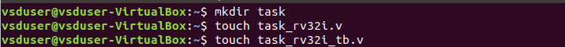
     
      <li>Photos of the code and testbench written.</li>
      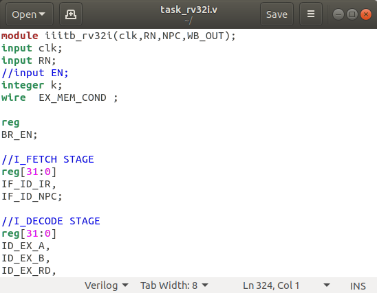
     
     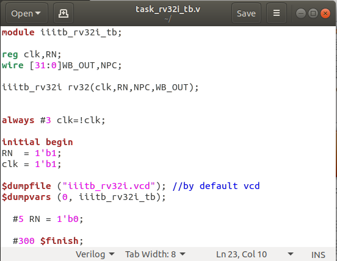
     
      <li>Enter the following instructions shown in image below.This code is written to simulate verilog code </li>
      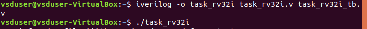  
      <li>Use GTKWave to see the simulation by writing the below code.</li>
      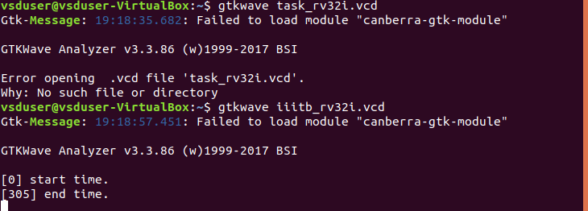  
      <li>Simulation output.</li>
        
        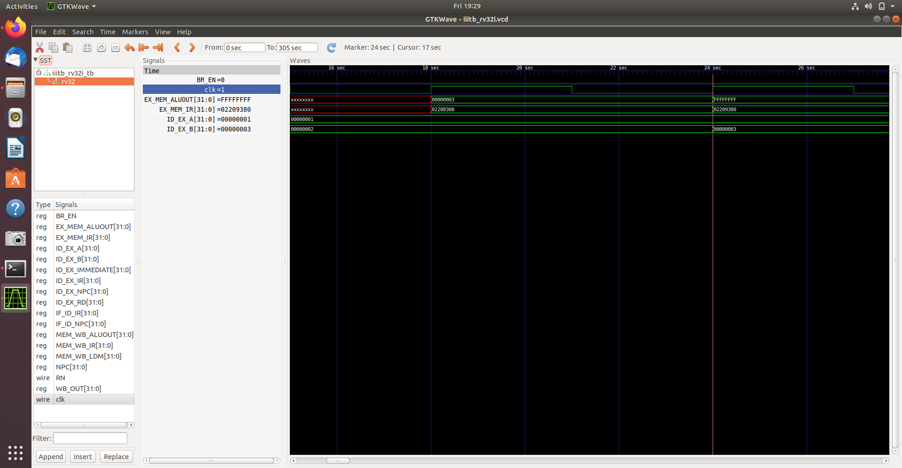
  </OL>
</h4>
  

 <h2> TASK 5</h2>
<h3> To create a project using VSDSquadron Mini </h3> 

<h3> Task 5 involves the folowing steps: </h3>
 
  
<ol>
  <li> To make a project using VSDSquadron.</li>
  <li>  To upload the overview,components required, circuit connection, pinout diagram and table for Pin connection on GitHub. </li>
</ol>
<h4>
 <b>OVERVIEW:</b>
   
   
A Full Adder is a digital circuit that adds three binary inputs: two significant bits (A and B) and a carry-in (Cin). It outputs a Sum and a carry-out (Cout). The logic is defined as:

Sum = 
𝐴
⊕
𝐵
⊕
𝐶
𝑖
𝑛
A⊕B⊕Cin (XOR operation).
Cout = 
(
𝐴
⋅
𝐵
)
+
(
𝐶
𝑖
𝑛
⋅
(
𝐴
⊕
𝐵
)
)
(A⋅B)+(Cin⋅(A⊕B)) (AND/OR operation).
It is a key component in arithmetic circuits like ripple-carry adders, enabling multi-bit binary addition. Commonly used in processors and ALUs, it plays a vital role in performing binary arithmetic operations.
   
   <OL>
      
      
     Components Required
      
      
  <li> VSD Squadron Mini developement board </li>
      
<li>USB C Cable</li>
      
<li> Push button </li>
      
<li> Bread Board </li>
      
<li> Male to Male; Male to Female jumper cable </li>
      
<li> Red LED and green LED</li>
      
  </OL>
  </h4>
<h4> The pin diagram and the pin connections are given below:
  
  
  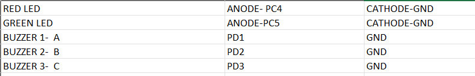 </h4> 
  <h4><b>
    <code>
      
#define  UART_MODULE_ENABLED
#define I2C_MODULE_ENABLED
#define ADC_MODULE_ENABLED
#define SPI_MODULE_ENABLED
// LED connected to PD6 (onboard LED)
// Define the pins
#define A_PIN PD1
#define B_PIN PD2
#define CIN_PIN PD3
#define SUM_PIN PC4
#define COUT_PIN PC5
void setup() {
  // Configure input pins
  pinMode(A_PIN, INPUT);
  pinMode(B_PIN, INPUT);
  pinMode(CIN_PIN, INPUT);
  // Configure output pins
  pinMode(SUM_PIN, OUTPUT);
  pinMode(COUT_PIN, OUTPUT);
}
void loop() {
  // Read inputs
  int A = digitalRead(A_PIN);
  int B = digitalRead(B_PIN);
  int Cin = digitalRead(CIN_PIN);
  // Calculate Sum and Cout
  int Sum = A ^ B ^ Cin; // XOR for Sum
  int Cout = (A & B) | (Cin & (A ^ B)); // AND/OR for Cout
  // Set output pins
  digitalWrite(SUM_PIN, Sum);
  digitalWrite(COUT_PIN, Cout);
}
  </code> 
Applications of Full Adder
<OL>
     
<li>Multi-Bit Binary Addition: Used in ripple-carry adders to add binary numbers with more than one bit.</li>
 
<li>Arithmetic Logic Units (ALUs): Forms the foundation of arithmetic operations in processors.</li>
 
<li>Binary Multiplication: Helps in generating partial products for binary multiplication.</li>
 
<li>Digital Signal Processing: Facilitates arithmetic computations in filters and transforms.</li>
 
<li>Error Detection and Correction: Plays a role in checksums and other algorithms in communication systems.</li>
 
<li>Data Encryption: Used in bit-wise operations within cryptographic algorithms.</li>
 
<li>Embedded Systems: Integral to control units and arithmetic operations in microcontrollers.</li>
</OL>   
  </b></h4>
  

 

 <h2> TASK 6</h2>
<h3> To upload the video of the project. </h3> 

<h3> Task 6 involves the folowing steps: </h3>
 
  
<ol>
  <li> To make a video of the project.</li>
  <li>  To upload the video on Github. </li>
</ol>
 
<h3>VIDEO:</h3>
<a href="https://drive.google.com/file/d/1-CpyeXVj2u8IxucOdjbWfYfybVLiqSFM/view?usp=drive_link" target="_blank">
    Video link
</a>

<h3>INFERENCE </h3>
 
<OL>
<li> IT IS ZERO WHEN THE PUSH BUTTON IS PRESSED</li>
   
<li>HERE THE RED LED REPRESENTS SUM AND GREEN LED REPRESENTS CARRY</li>
 
<li>WE CAN OBSERVE THAT WHEN THE BUTTONS ARE NOT PRESSED IT IS 111. ACCORDING TO THE TRUTH TABLE THE OUTPUT IS 1 1. SO THE RED LED AND GREEN LED IS TURNED ON </li>
 
<li>WHEN THE INPUT IS 000, THE OUTPUT IS 0 0. HENCE THE LED DOESN'T GLOW</li>
 
<li>WHEN INPUT IS 001 THE OUTPUT IS 1 0. HENCE THE RED LED GLOWS.</li>
 
<li>WHEN THE INPUT IS 011, THE OUTPUT IS 0 1. THEREFORE GREEN LED GLOWS</li>
 
</OL>
 

<h3>CONCLUSION</h3>
 
The demonstration of full adder circuit using VSD Squadron mini is observed. 

  <h2> ACKNOWLEDGMENT</h2>
<h3> I sincerely thank Kunal Ghosh Sir for the opportunity to explore RISCV Architecture through this internship with the VSDSquadron Mini. It has been an inspiring introduction to the field, sparking my curiosity and enhancing my skills. I am also grateful to VLSI System Design for offering such a meaningful learning experience that has shaped my growth. </h3>

